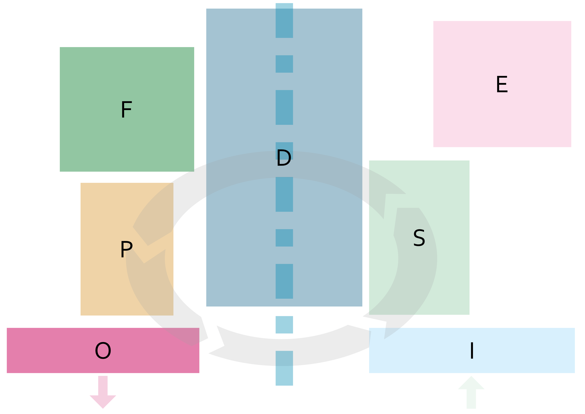

= Common API
Kasta Group LLC <info@tbt-post.net>
1.4.1, 2019-11-01: WMS ERP API v2019.2
:toc: right
:toclevels: 4
{empty}

== Общая информация

Базовая структура склада представляется однонаправленным операционным циклом согласно следующей диаграммы

.Базовая структура

где буквами обозначены зоны:

[Attributes]
|===
|Литера |Значение |Описание

| **I**
|Input zone
|Зона приемки грузов

| **S**
|Sorting zone
|Зона обработки (сортировки) товаров

| **D**
|Depot zone
|Зона хранения товара

| **F^*^**
|Fulfillment^*^ zone
|Зона сортировки-сборки груза

| **P**
|Packing zone
|Зона контроля и упаковки груза

| **O**
|Output zone
|Зона отгрузки/выдачи грузов

| **E^**^**
|Error zone^**^
|Зона обработки ошибок
|===

.Комментарии
[horizontal]
*:: Зона сортировки-сборки может не быть задействована в операционном процессе или быть задействована частично/не всегда
**:: Зона обработки ошибок -- отдельностоящий __замкнутый__ операционный процесс, не включаемый напрямую в общий цикл

== API

=== Реестры

CAUTION:: Ограничения на размер одного реестра при загрузке: 10000 единиц товара / 4Мб размер реестра в формате передачи

==== Получение схемы валидации

[horizontal]
protocol_method:: GET
method_name:: agent/schema
method_params:: <schema-name>
get_params::
request_body:: ----
expected_result:: 200 {<json schema>}

Пример запроса/ответа::
Запрос::
[source, shell]
----
curl -v  "https://sandbox-api.tbt-post.net/api/v1/agent/schema/wms_items_in" \
-H "Content-Type: application/json" \
-H "Authorization: Basic YZjEtMzJiZDdaelE"
----

Ответ::

[source, json]
----
{
  "anyOf": [
    {
      "required": [
        "origin",
        "generated",
        "serial"
      ]
    },
    {
      "required": [
        "origin",
        "generated",
        "uid"
      ]
    },
    {
      "required": [
        "origin",
        "userial"
      ]
    }
  ],
  "dependencies": {
    "items": {
      "required": [
        "definitions",
        "total"
      ]
    }
  },
  "additionalProperties": false,
  "definitions": {
    "color_model_hsl": {
      "required": [
        "color_model",
        "color_value"
      ],
      "type": "object",
      "properties": {
        "color_value": {
          "minItems": 3,
          "items": [
            {
              "minimum": 0,
              "type": "number",
              "maximum": 360
            },
            {
              "minimum": 0,
              "type": "number",
              "maximum": 100
            },
            {
              "minimum": 0,
              "type": "number",
              "maximum": 100
            }
          ],
          "additionalItems": false,
          "type": "array"
        },
        "color_model": {
          "enum": [
            "hsl"
          ],
          "type": "string"
        }
      }
    },
    "task_unload": {
      "type": "object",
      "properties": {
        "action": {
          "enum": [
            "unload"
          ],
          "type": "string"
        },
        "spec": {
          "additionalProperties": false,
          "required": [
            "items",
            "type",
            "class",
            "delivery_type",
            "sender",
            "receiver",
            "address_id"
          ],
          "type": "object",
          "properties": {
            "dest_apartment": {
              "type": "string"
            },
            "address_id": {
              "$ref": "#/definitions/uuid"
            },
            "cod_amount": {
              "minimum": 0.01,
              "type": "number",
              "maximum": 9999999999.99,
              "multipleOf": 0.01
            },
            "sender": {
              "$ref": "#/definitions/uuid"
            },
            "delivery_service": {
              "enum": [
                "self_delivery",
                "kastapost",
                "novaposhta",
                "ukrposhta",
                "meest",
                "intime",
                "justin"
              ],
              "type": "string"
            },
            "receiver": {
              "$ref": "#/definitions/uuid"
            },
            "delivery_type": {
              "enum": [
                "W2W",
                "W2D",
                "D2W",
                "D2D"
              ],
              "type": "string"
            },
            "parcel_code": {
              "anyOf": [
                {
                  "type": "null"
                },
                {
                  "pattern": "^[^ ]{6,32}$",
                  "type": "string",
                  "description": "some parcel group code, e.g. order id or delivery reg @ external ERP"
                }
              ]
            },
            "note": {
              "type": "string"
            },
            "items": {
              "items": {
                "pattern": "^[^ ]{6,32}$",
                "type": "string",
                "description": "unique sku code, e.g. MK0A123456789012"
              },
              "type": "array"
            },
            "dest_branch_id": {
              "pattern": "^[^ ]{2,128}$",
              "type": "string"
            },
            "type": {
              "enum": [
                "undef",
                "papers",
                "fragile",
                "goods",
                "foods",
                "chemicals",
                "special",
                "hazard"
              ],
              "type": "string"
            },
            "class": {
              "type": "string",
              "description": "parcel class, e.g. I.PRP.NR.NA.S000"
            }
          }
        }
      }
    },
    "task": {
      "allOf": [
        {
          "$ref": "#/definitions/task_common"
        },
        {
          "oneOf": [
            {
              "$ref": "#/definitions/task_store"
            },
            {
              "$ref": "#/definitions/task_unload"
            },
            {
              "$ref": "#/definitions/task_fulfill"
            }
          ]
        }
      ]
    },
    "uuid": {
      "pattern": "^[0-9a-fA-F]{8}-[0-9a-fA-F]{4}-[0-9a-fA-F]{4}-[0-9a-fA-F]{4}-[0-9a-fA-F]{12}$",
      "type": "string"
    },
    "color_model_cmyk": {
      "type": "object",
      "properties": {
        "color_value": {
          "minItems": 4,
          "items": {
            "minimum": 0,
            "type": "number",
            "maximum": 100
          },
          "type": "array",
          "maxItems": 4
        },
        "color_model": {
          "enum": [
            "cmyk"
          ],
          "type": "string"
        }
      }
    },
    "uuid_v1": {
      "pattern": "^[0-9a-fA-F]{8}-[0-9a-fA-F]{4}-1[0-9a-fA-F]{3}-[0-9a-fA-F]{4}-[0-9a-fA-F]{12}$",
      "type": "string"
    },
    "color_model_lab": {
      "required": [
        "color_model",
        "color_value"
      ],
      "type": "object",
      "properties": {
        "color_value": {
          "minItems": 3,
          "items": [
            {
              "minimum": 0,
              "type": "number",
              "maximum": 100
            },
            {
              "minimum": -100,
              "type": "number",
              "maximum": 100
            },
            {
              "minimum": -100,
              "type": "number",
              "maximum": 100
            }
          ],
          "additionalItems": false,
          "type": "array"
        },
        "color_model": {
          "enum": [
            "lab"
          ],
          "type": "string"
        }
      }
    },
    "item_class": {
      "additionalProperties": false,
      "required": [
        "type",
        "weight",
        "dimensions",
        "description"
      ],
      "type": "object",
      "properties": {
        "type": {
          "enum": [
            "item_class"
          ],
          "type": "string"
        },
        "dimensions": {
          "minItems": 3,
          "items": {
            "minimum": 0,
            "type": "integer"
          },
          "type": "array",
          "description": "width, height, depth, in mm",
          "maxItems": 3
        },
        "weight": {
          "type": "integer",
          "description": "weight, in grams"
        },
        "description": {
          "required": [
            "article",
            "code",
            "name",
            "brand",
            "type",
            "size",
            "size_class",
            "color",
            "origin",
            "composition",
            "info",
            "product_id",
            "photos"
          ],
          "type": "object",
          "properties": {
            "lang": {
              "enum": [
                "ru",
                "uk",
                "en"
              ],
              "type": "string"
            },
            "info": {
              "type": "string",
              "description": "verbose description"
            },
            "code": {
              "type": "string",
              "description": "EAN-13 manufacturer barcode, e.g. 978020137962"
            },
            "size_class": {
              "type": "string",
              "description": "size chart used, e.g. EU"
            },
            "product_id": {
              "type": "string",
              "description": "e.g. 431231234"
            },
            "tags": {
              "items": {
                "pattern": "^[^ ]{3,24}$",
                "type": "string"
              },
              "type": "array",
              "description": "e.g. additional marks to help identify the item",
              "maxItems": 30
            },
            "color": {
              "additionalProperties": false,
              "required": [
                "$ref"
              ],
              "type": "object",
              "properties": {
                "$ref": {
                  "$ref": "#/definitions/uuid"
                }
              }
            },
            "season": {
              "enum": [
                "winter",
                "summer",
                "spring",
                "fall",
                "demi-season",
                "demi-season-summer",
                "demi-season-winter",
                "all-season"
              ],
              "type": "string"
            },
            "brand": {
              "type": "string",
              "description": "e.g. Adidas"
            },
            "fragile": {
              "type": "boolean"
            },
            "price": {
              "minimum": 0.01,
              "type": "number",
              "maximum": 9999999999.99,
              "multipleOf": 0.01
            },
            "photos": {
              "items": {
                "type": "string",
                "format": "uri"
              },
              "type": "array"
            },
            "gender": {
              "enum": [
                "female",
                "male",
                "unisex"
              ],
              "type": "string"
            },
            "article": {
              "type": "string"
            },
            "size": {
              "type": "string",
              "description": "e.g. 42"
            },
            "type": {
              "type": "string",
              "description": "e.g. shoes"
            },
            "composition": {
              "type": "string",
              "description": "string with delimiter ';', material substance in '%'"
            },
            "origin": {
              "type": "string",
              "description": "manufacturer country e.g. Singapore"
            },
            "name": {
              "type": "string",
              "description": "e.g. Cargo"
            }
          }
        }
      }
    },
    "color_model_rgb": {
      "required": [
        "color_model",
        "color_value"
      ],
      "type": "object",
      "properties": {
        "color_value": {
          "minItems": 3,
          "items": {
            "minimum": 0,
            "type": "integer",
            "maximum": 255
          },
          "type": "array",
          "maxItems": 3
        },
        "color_model": {
          "enum": [
            "rgb"
          ],
          "type": "string"
        }
      }
    },
    "uuid_v4": {
      "pattern": "^[0-9a-fA-F]{8}-[0-9a-fA-F]{4}-4[0-9a-fA-F]{3}-[0-9a-fA-F]{4}-[0-9a-fA-F]{12}$",
      "type": "string"
    },
    "color_class_common": {
      "additionalProperties": false,
      "required": [
        "type",
        "color_name",
        "color_model",
        "color_id"
      ],
      "type": "object",
      "properties": {
        "color_value": {},
        "color_model": {
          "enum": [
            "undef",
            "rgb",
            "hsl",
            "lab",
            "cmyk"
          ],
          "type": "string"
        },
        "color_name": {
          "type": "string"
        },
        "type": {
          "enum": [
            "color_class"
          ],
          "type": "string"
        },
        "color_id": {
          "type": "string",
          "description": "reference to color in external system, e.g. 87463234"
        }
      }
    },
    "task_fulfill": {
      "type": "object",
      "properties": {
        "action": {
          "enum": [
            "fulfill"
          ],
          "type": "string"
        },
        "spec": {
          "additionalProperties": false,
          "patternProperties": {
            "^[0-9a-fa-fA-F]{8}-[0-9a-fa-fA-F]{4}-[0-9a-fa-fA-F]{4}-[0-9a-fa-fA-F]{4}-[0-9a-fa-fA-F]{12}$": {
              "additionalProperties": false,
              "required": [
                "items"
              ],
              "type": "object",
              "properties": {
                "items": {
                  "items": {
                    "type": "string"
                  },
                  "type": "array"
                }
              }
            }
          },
          "type": "object"
        }
      }
    },
    "color_class": {
      "allOf": [
        {
          "$ref": "#/definitions/color_class_common"
        },
        {
          "oneOf": [
            {
              "$ref": "#/definitions/color_model_undef"
            },
            {
              "$ref": "#/definitions/color_model_rgb"
            },
            {
              "$ref": "#/definitions/color_model_hsl"
            },
            {
              "$ref": "#/definitions/color_model_lab"
            },
            {
              "$ref": "#/definitions/color_model_cmyk"
            }
          ]
        }
      ]
    },
    "color_model_undef": {
      "type": "object",
      "properties": {
        "color_value": {
          "type": "null"
        },
        "color_model": {
          "enum": [
            "undef"
          ],
          "type": "string"
        }
      }
    },
    "task_common": {
      "additionalProperties": false,
      "required": [
        "action",
        "spec"
      ],
      "type": "object",
      "properties": {
        "action": {
          "enum": [
            "store",
            "unload",
            "fulfill"
          ],
          "type": "string"
        },
        "spec": {}
      }
    },
    "task_store": {
      "type": "object",
      "properties": {
        "action": {
          "enum": [
            "store"
          ],
          "type": "string"
        },
        "spec": {
          "additionalProperties": false,
          "required": [
            "items"
          ],
          "type": "object",
          "properties": {
            "items": {
              "items": {
                "type": "string",
                "description": "unique sku code or ref to item-class"
              },
              "type": "array"
            },
            "box_code": {
              "pattern": "^[^ ]{6,32}$",
              "type": "string",
              "description": "external box barcode"
            }
          }
        }
      }
    }
  },
  "$schema": "http://json-schema.org/draft-07/schema#",
  "type": "object",
  "properties": {
    "origin": {
      "$ref": "#/definitions/uuid_v4"
    },
    "tasks": {
      "items": {
        "$ref": "#/definitions/task"
      },
      "type": "array"
    },
    "description": {
      "anyOf": [
        {
          "minLength": 0,
          "type": "string",
          "maxLength": 255
        },
        {
          "type": "null"
        }
      ]
    },
    "userial": {
      "$ref": "#/definitions/uuid_v1"
    },
    "workflow": {
      "enum": [
        "divergence"
      ],
      "type": "string"
    },
    "registry_of": {
      "anyOf": [
        {
          "enum": [
            "direct",
            "reverse-normal",
            "reverse-problem",
            "internal"
          ],
          "type": "string"
        },
        {
          "type": "null"
        }
      ]
    },
    "items": {
      "items": {
        "oneOf": [
          {
            "pattern": "^[^ ]{8,32}$",
            "type": "string",
            "description": "code, e.g. MK0A123456789012"
          },
          {
            "additionalProperties": false,
            "required": [
              "type",
              "quantity",
              "class",
              "weight",
              "dimensions"
            ],
            "type": "object",
            "properties": {
              "code": {
                "pattern": "^[^ ]{8,32}$",
                "type": "string",
                "description": "code, e.g. MK0A123456789012"
              },
              "dimensions": {
                "minItems": 3,
                "items": {
                  "minimum": 0,
                  "type": "integer"
                },
                "type": "array",
                "description": "width, height, depth, in mm",
                "maxItems": 3
              },
              "weight": {
                "minimum": 0,
                "type": "integer",
                "description": "weight, in grams"
              },
              "note": {
                "type": "string",
                "description": "text comment, optional"
              },
              "type": {
                "enum": [
                  "item"
                ],
                "type": "string"
              },
              "class": {
                "additionalProperties": false,
                "required": [
                  "$ref"
                ],
                "type": "object",
                "properties": {
                  "$ref": {
                    "description": "e.g. 730b6997-0b46-4f75-a749-e2f512be25ff",
                    "$ref": "#/definitions/uuid"
                  }
                }
              },
              "quantity": {
                "minimum": 1,
                "type": "integer"
              }
            }
          }
        ]
      },
      "type": "array"
    },
    "produced_by": {
      "anyOf": [
        {
          "enum": [
            "kp",
            "up",
            "np",
            "me",
            "it"
          ],
          "type": "string"
        },
        {
          "type": "null"
        }
      ]
    },
    "req_pproc": {
      "type": "boolean"
    },
    "generated": {
      "minimum": 0,
      "type": "integer",
      "description": "timestamp e.g. 1531752070460"
    },
    "items_owner": {
      "$ref": "#/definitions/uuid_v4"
    },
    "is_announce": {
      "type": "boolean"
    },
    "req_rac": {
      "type": "boolean"
    },
    "definitions": {
      "additionalProperties": false,
      "patternProperties": {
        "^[0-9a-fa-fA-F]{8}-[0-9a-fa-fA-F]{4}-[0-9a-fa-fA-F]{4}-[0-9a-fa-fA-F]{4}-[0-9a-fa-fA-F]{12}$": {
          "oneOf": [
            {
              "$ref": "#/definitions/color_class"
            },
            {
              "$ref": "#/definitions/item_class"
            }
          ]
        }
      },
      "type": "object"
    },
    "serial": {
      "minimum": 0,
      "type": "integer",
      "description": "timestamp e.g. 145481128145898"
    },
    "total": {
      "type": "integer",
      "description": "e.g. 10"
    },
    "uid": {
      "$ref": "#/definitions/uuid"
    }
  }
}
----

[cols="^70",options="header"]
|===
|<schema-name>
|**wms_items_in**  - _валидация реестра для загрузки_
|**wms_items_out** - _валидация данных результата реестра_ (в данном случае - в ответе, а не запросе)
|**wms_event** - _валидация сообщений wms event_ (такие сообщения будут отправлятья во внешнюю систему)
|===

==== Загрузка реестра

[horizontal]
protocol_method:: POST
method_name:: agent/wms/items
method_params:: ----
request_body:: {<registry by wms_items_in schema>}
expected_result:: 200 {<json schema>}

Пример запроса/ответа::
Запрос::
[source, shell]
----
curl -v -X POST "https://sandbox-api.tbt-post.net/api/v1/agent/wms/items" -H "Content-Type: application/json" -H "Authorization: Basic YZjEtMzJiZDdaelE" -d '{"origin":"293d98fc-80e3-476b-86a3-62eefcd91665","tasks":[{"action":"fulfill","spec":{"312153ec-3d06-46ec-a2e3-87e8b1bb0122":{"items":["50000323849711","50000338701827"]}}}],"uid":"a5acf9c9-999f-41fb-b3de-585689b02eb3","userial":"3a30bd80-7406-11ea-8ddd-790d4a755f6d","items":[{"code":"50000323849711","dimensions":[0,0,0],"weight":350,"note":"","type":"item","class":{"$ref":"216ed0f5-f332-11e9-80de-005056a8435c"},"quantity":1},{"code":"50000338701827","dimensions":[0,0,0],"weight":300,"note":"","type":"item","class":{"$ref":"43058f46-4f01-11ea-80e8-005056a8435c"},"quantity":1}],"generated":1585735854000,"definitions":{"216ed0f5-f332-11e9-80de-005056a8435c":{"type":"item_class","dimensions":[0,0,0],"weight":350,"description":{"lang":"ru","info":"На размер L длина изделия по спинке 68 см, длина рукава 68 см.","code":"50000323849711","size_class":"","product_id":"9747234.695","tags":[],"color":{"$ref":"31d789f9-a83a-4a09-b953-a4261cb09910"},"brand":"ZARA","fragile":false,"photos":["https://kasta.ua/imgw/loc/0x0/uploads/product_image/2019/10/76/ea4db185943486992048fe41e98c898c.jpg","https://kasta.ua/imgw/loc/0x0/uploads/product_image/2019/10/76/caa267862b51d9c4f24e5d4d0a12f0c9.jpg","https://kasta.ua/imgw/loc/0x0/uploads/product_image/2019/10/76/8d192515d5e5f514fceadbe540dc64df.jpg","https://kasta.ua/imgw/loc/0x0/uploads/product_image/2019/10/76/70a16070519236633db441f7f6c7b8f5.jpg","https://kasta.ua/imgw/loc/0x0/uploads/product_image/2019/10/76/6ebbfca1f557e3d462648191d637a617.jpg"],"article":"0414/301_синий","size":"М","type":"Поло","composition":"","origin":"Португалия","name":"Поло"}},"31d789f9-a83a-4a09-b953-a4261cb09910":{"color_model":"undef","color_name":"Темно-синий","type":"color_class","color_id":"695"},"7d331617-f496-4167-93ce-a6cf071695d7":{"color_model":"undef","color_name":"Терракотовый","type":"color_class","color_id":"697"},"43058f46-4f01-11ea-80e8-005056a8435c":{"type":"item_class","dimensions":[0,0,0],"weight":300,"description":{"lang":"ru","info":"Длина изделия: 42 см. Описание для размера: EUR M.","code":"50000338701827","size_class":"","product_id":"10117296.697","tags":[],"color":{"$ref":"7d331617-f496-4167-93ce-a6cf071695d7"},"brand":"ZARA","fragile":false,"photos":["https://kasta.ua/imgw/loc/0x0/uploads/product_image/2020/02/58/edc114ad89753ce3b5176b527dc5bf9a.jpg","https://kasta.ua/imgw/loc/0x0/uploads/product_image/2020/02/58/d5ef0c5f7edae93e6c573ab063243de0.jpg","https://kasta.ua/imgw/loc/0x0/uploads/product_image/2020/02/58/3c6f04fd406a95b6e43da523172648d7.jpg","https://kasta.ua/imgw/loc/0x0/uploads/product_image/2020/02/58/5eef7318dd81fd578d9eb087d5698408.jpg","https://kasta.ua/imgw/loc/0x0/uploads/product_image/2020/02/58/dd266888a7650d5e197f18c6567b8abe.jpg"],"article":"4886/256/642","size":"EUR XS","type":"Юбка","composition":"","origin":"Турция","name":"Юбка"}}},"serial":4463721332654658,"total":2}'
----

NOTE: Пример тела запроса в читаемом формате: 
[source, json]
----
{
  "origin": "293d98fc-80e3-476b-86a3-62eefcd91665",
  "tasks": [
    {
      "action": "fulfill",
      "spec": {
        "312153ec-3d06-46ec-a2e3-87e8b1bb0122": {
          "items": [
            "50000323849711",
            "50000338701827"
          ]
        }
      }
    }
  ],
  "uid": "a5acf9c9-999f-41fb-b3de-585689b02eb3",
  "userial": "3a30bd80-7406-11ea-8ddd-790d4a755f6d",
  "items": [
    {
      "code": "50000323849711",
      "dimensions": [
        0,
        0,
        0
      ],
      "weight": 350,
      "note": "",
      "type": "item",
      "class": {
        "$ref": "216ed0f5-f332-11e9-80de-005056a8435c"
      },
      "quantity": 1
    },
    {
      "code": "50000338701827",
      "dimensions": [
        0,
        0,
        0
      ],
      "weight": 300,
      "note": "",
      "type": "item",
      "class": {
        "$ref": "43058f46-4f01-11ea-80e8-005056a8435c"
      },
      "quantity": 1
    }
  ],
  "generated": 1585735854000,
  "definitions": {
    "216ed0f5-f332-11e9-80de-005056a8435c": {
      "type": "item_class",
      "dimensions": [
        0,
        0,
        0
      ],
      "weight": 350,
      "description": {
        "lang": "ru",
        "info": "На размер L длина изделия по спинке 68 см, длина рукава 68 см.",
        "code": "50000323849711",
        "size_class": "",
        "product_id": "9747234.695",
        "tags": [],
        "color": {
          "$ref": "31d789f9-a83a-4a09-b953-a4261cb09910"
        },
        "brand": "ZARA",
        "fragile": false,
        "photos": [
          "https://kasta.ua/imgw/loc/0x0/uploads/product_image/2019/10/76/ea4db185943486992048fe41e98c898c.jpg",
          "https://kasta.ua/imgw/loc/0x0/uploads/product_image/2019/10/76/caa267862b51d9c4f24e5d4d0a12f0c9.jpg",
          "https://kasta.ua/imgw/loc/0x0/uploads/product_image/2019/10/76/8d192515d5e5f514fceadbe540dc64df.jpg",
          "https://kasta.ua/imgw/loc/0x0/uploads/product_image/2019/10/76/70a16070519236633db441f7f6c7b8f5.jpg",
          "https://kasta.ua/imgw/loc/0x0/uploads/product_image/2019/10/76/6ebbfca1f557e3d462648191d637a617.jpg"
        ],
        "article": "0414/301_синий",
        "size": "М",
        "type": "Поло",
        "composition": "",
        "origin": "Португалия",
        "name": "Поло"
      }
    },
    "31d789f9-a83a-4a09-b953-a4261cb09910": {
      "color_model": "undef",
      "color_name": "Темно-синий",
      "type": "color_class",
      "color_id": "695"
    },
    "7d331617-f496-4167-93ce-a6cf071695d7": {
      "color_model": "undef",
      "color_name": "Терракотовый",
      "type": "color_class",
      "color_id": "697"
    },
    "43058f46-4f01-11ea-80e8-005056a8435c": {
      "type": "item_class",
      "dimensions": [
        0,
        0,
        0
      ],
      "weight": 300,
      "description": {
        "lang": "ru",
        "info": "Длина изделия: 42 см. Описание для размера: EUR M.",
        "code": "50000338701827",
        "size_class": "",
        "product_id": "10117296.697",
        "tags": [],
        "color": {
          "$ref": "7d331617-f496-4167-93ce-a6cf071695d7"
        },
        "brand": "ZARA",
        "fragile": false,
        "photos": [
          "https://kasta.ua/imgw/loc/0x0/uploads/product_image/2020/02/58/edc114ad89753ce3b5176b527dc5bf9a.jpg",
          "https://kasta.ua/imgw/loc/0x0/uploads/product_image/2020/02/58/d5ef0c5f7edae93e6c573ab063243de0.jpg",
          "https://kasta.ua/imgw/loc/0x0/uploads/product_image/2020/02/58/3c6f04fd406a95b6e43da523172648d7.jpg",
          "https://kasta.ua/imgw/loc/0x0/uploads/product_image/2020/02/58/5eef7318dd81fd578d9eb087d5698408.jpg",
          "https://kasta.ua/imgw/loc/0x0/uploads/product_image/2020/02/58/dd266888a7650d5e197f18c6567b8abe.jpg"
        ],
        "article": "4886/256/642",
        "size": "EUR XS",
        "type": "Юбка",
        "composition": "",
        "origin": "Турция",
        "name": "Юбка"
      }
    }
  },
  "serial": 4463721332654658,
  "total": 2
}
----

Ответ::
HTTP/1.1 200 OK +
Server: nginx/1.10.3 +
Date: Wed, 01 Apr 2020 14:38:54 GMT +
Content-Type: application/json; charset=utf-8 +
Content-Length: 17 +
Connection: keep-alive +

[source, json]
----
{"success": true}
----

==== Получение списка реестров

[horizontal]
protocol_method:: GET
method_name:: agent/wms-exchange/registry/
method_params:: list
get_params:: limit=<integer>, offset=<integer>, sort_order=<desc|asc>,
filter params=[is_valid, is_processed],
is_closed= <true|false>,
task=<store|unload|fulfill>,
order_id=<registry order>,
supplier_id=<registry supplier reg_id>,
request_body:: ----
expected_result:: 200 {<json schema>}

NOTE: Все параметры опциональны.

Пример запроса/ответа::
Запрос::
[source, shell]
----
curl -v "https://sandbox-api.tbt-post.net/api/v1/agent/wms-exchange/registry/list?limit=2&sort_order=desc&filter_params=is_valid&is_close=false&" -H "Content-Type: application/json" -H "Authorization: Basic YZjEtMzJiZDdaelE"
----

Ответ::
HTTP/1.1 200 OK +
Server: nginx/1.10.3 +
Date: Wed, 01 Apr 2020 15:17:34 GMT +
Content-Type: application/json; charset=utf-8 +
Content-Length: 800 +
Connection: keep-alive +
Etag: "24693b561a8811560b17fb775cef64b8a8aa73a1" +

[source, json]
----
{
  "items": [
    {
      "origin": "293d98fc-80e3-476b-86a3-62eefcd91665",
      "tasks": [
        "fulfill"
      ],
      "uid": "a5acf9c9-999f-41fb-b3de-585689b02eb3",
      "userial": "3a30bd80-7406-11ea-8ddd-790d4a755f6d",
      "is_processed": true,
      "generated": 1585735854000,
      "is_valid": false,
      "stored_at": "2020-04-01T13:50:41Z",
      "records_total": 2,
      "serial": 4463721332654658,
      "is_closed": true,
      "description": null
    },
    {
      "origin": "293d98fc-80e3-476b-86a3-62eefcd91665",
      "tasks": [
        "store"
      ],
      "uid": "6f27026e-506c-46f9-a0f5-8e265c8cf43b",
      "userial": "f39f6b20-62e7-11ea-aecb-790d4a755f6d",
      "is_processed": true,
      "generated": 1583855890000,
      "is_valid": true,
      "stored_at": "2020-03-10T15:58:15Z",
      "records_total": 2,
      "serial": 4463719452690193,
      "is_closed": false,
      "description": "00000000000000000606;2353100019;380975555554;"
    }
  ],
  "page_size": 2
}
----

==== Получения данных одного реестра

[horizontal]
protocol_method:: GET
method_name:: agent/wms-exchange/registry
method_params:: ----
get_params:: generated=<reg-generated>, serial=<reg-serial> | [userial=<reg-userial>]
request_body:: ----
expected_result:: 200 {<json schema>}

NOTE: Получение возможно либо по паре `generated` & `serial` или по `userial`

Пример запроса/ответа::
Запрос::
[source, shell]
----
curl -v "https://sandbox-api.tbt-post.net/api/v1/agent/wms-exchange/registry/?generated=1585735854000&serial=4463721332654658" -H "Content-Type: application/json" -H "Authorization: Basic YZjEtMzJiZDdaelE"
----

Ответ::
HTTP/1.1 200 OK +
Server: nginx/1.10.3 +
Date: Wed, 01 Apr 2020 15:31:12 GMT +
Content-Type: application/json; charset=utf-8 +
Content-Length: 4205 +
Connection: keep-alive +
Etag: "b86e95df3264aa9d040d000163f1c275c09c6ee6" +

[source, json]
----
{
  "is_processed": true,
  "analysis": {
    "unload-not-intersected": true,
    "total-vs-tasks": true,
    "fulfill-not-intersected": true,
    "tasks-items-all-unique": true,
    "store-not-intersected": true,
    "all-items-are-in-stock": false,
    "only-known-tasks": true,
    "total-vs-items": true
  },
  "summary": {
    "not-in-stock": [
      "50000323849711",
      "50000338701827"
    ]
  },
  "generated": 1585735854000,
  "is_valid": false,
  "stored_at": "2020-04-01T13:50:41.697Z",
  "serial": 4463721332654658,
  "payload": {
    "origin": "293d98fc-80e3-476b-86a3-62eefcd91665",
    "tasks": [
      {
        "action": "fulfill",
        "spec": {
          "312153ec-3d06-46ec-a2e3-87e8b1bb0122": {
            "items": [
              "50000323849711",
              "50000338701827"
            ]
          }
        }
      }
    ],
    "uid": "a5acf9c9-999f-41fb-b3de-585689b02eb3",
    "userial": "3a30bd80-7406-11ea-8ddd-790d4a755f6d",
    "items": [
      {
        "code": "50000323849711",
        "dimensions": [
          0,
          0,
          0
        ],
        "weight": 350,
        "note": "",
        "type": "item",
        "class": {
          "$ref": "216ed0f5-f332-11e9-80de-005056a8435c"
        },
        "quantity": 1
      },
      {
        "code": "50000338701827",
        "dimensions": [
          0,
          0,
          0
        ],
        "weight": 300,
        "note": "",
        "type": "item",
        "class": {
          "$ref": "43058f46-4f01-11ea-80e8-005056a8435c"
        },
        "quantity": 1
      }
    ],
    "generated": 1585735854000,
    "definitions": {
      "216ed0f5-f332-11e9-80de-005056a8435c": {
        "type": "item_class",
        "dimensions": [
          0,
          0,
          0
        ],
        "weight": 350,
        "description": {
          "lang": "ru",
          "info": "На размер L длина изделия по спинке 68 см, длина рукава 68 см.",
          "code": "50000323849711",
          "size_class": "",
          "product_id": "9747234.695",
          "tags": [],
          "color": {
            "$ref": "31d789f9-a83a-4a09-b953-a4261cb09910"
          },
          "brand": "ZARA",
          "fragile": false,
          "photos": [
            "https://kasta.ua/imgw/loc/0x0/uploads/product_image/2019/10/76/ea4db185943486992048fe41e98c898c.jpg",
            "https://kasta.ua/imgw/loc/0x0/uploads/product_image/2019/10/76/caa267862b51d9c4f24e5d4d0a12f0c9.jpg",
            "https://kasta.ua/imgw/loc/0x0/uploads/product_image/2019/10/76/8d192515d5e5f514fceadbe540dc64df.jpg",
            "https://kasta.ua/imgw/loc/0x0/uploads/product_image/2019/10/76/70a16070519236633db441f7f6c7b8f5.jpg",
            "https://kasta.ua/imgw/loc/0x0/uploads/product_image/2019/10/76/6ebbfca1f557e3d462648191d637a617.jpg"
          ],
          "article": "0414/301_синий",
          "size": "М",
          "type": "Поло",
          "composition": "",
          "origin": "Португалия",
          "name": "Поло"
        }
      },
      "31d789f9-a83a-4a09-b953-a4261cb09910": {
        "color_model": "undef",
        "color_name": "Темно-синий",
        "type": "color_class",
        "color_id": "695"
      },
      "7d331617-f496-4167-93ce-a6cf071695d7": {
        "color_model": "undef",
        "color_name": "Терракотовый",
        "type": "color_class",
        "color_id": "697"
      },
      "43058f46-4f01-11ea-80e8-005056a8435c": {
        "type": "item_class",
        "dimensions": [
          0,
          0,
          0
        ],
        "weight": 300,
        "description": {
          "lang": "ru",
          "info": "Длина изделия: 42 см. Описание для размера: EUR M.",
          "code": "50000338701827",
          "size_class": "",
          "product_id": "10117296.697",
          "tags": [],
          "color": {
            "$ref": "7d331617-f496-4167-93ce-a6cf071695d7"
          },
          "brand": "ZARA",
          "fragile": false,
          "photos": [
            "https://kasta.ua/imgw/loc/0x0/uploads/product_image/2020/02/58/edc114ad89753ce3b5176b527dc5bf9a.jpg",
            "https://kasta.ua/imgw/loc/0x0/uploads/product_image/2020/02/58/d5ef0c5f7edae93e6c573ab063243de0.jpg",
            "https://kasta.ua/imgw/loc/0x0/uploads/product_image/2020/02/58/3c6f04fd406a95b6e43da523172648d7.jpg",
            "https://kasta.ua/imgw/loc/0x0/uploads/product_image/2020/02/58/5eef7318dd81fd578d9eb087d5698408.jpg",
            "https://kasta.ua/imgw/loc/0x0/uploads/product_image/2020/02/58/dd266888a7650d5e197f18c6567b8abe.jpg"
          ],
          "article": "4886/256/642",
          "size": "EUR XS",
          "type": "Юбка",
          "composition": "",
          "origin": "Турция",
          "name": "Юбка"
        }
      }
    },
    "serial": 4463721332654658,
    "total": 2
  },
  "is_closed": true
}

----

NOTE: Поле `payload` - содержимое реестра по схеме `wms_items_in`

==== Получение результатов обработки реестра

[horizontal]
protocol_method:: GET
method_name:: agent/wms-exchange/registry/
method_params:: results
get_params:: generated=<reg-generated>, serial=<reg-serial>
request_body:: ----
expected_result:: 200 {<json schema>}

Пример запроса/ответа::
Запрос::
[source, shell]
----
curl -v "https://sandbox-api.tbt-post.net/api/v1/agent/wms-exchange/registry/results?generated=1585735854000&serial=4463721332654658" -H "Content-Type: application/json" -H "Authorization: Basic YZjEtMzJiZDdaelE"
----

Ответ::
HTTP/1.1 200 OK +
Server: nginx/1.10.3 +
Date: Wed, 01 Apr 2020 15:40:16 GMT +
Content-Type: application/json; charset=utf-8 +
Content-Length: 527 +
Connection: keep-alive +
Etag: "86d42b69d4f0b4e4d168de827baa0265357c7fa4" +

[source, json]
----
{
  "not-in-stock": [
    "50000323849711",
    "50000338701827"
  ],
  "uid": "a5acf9c9-999f-41fb-b3de-585689b02eb3",
  "userial": "3a30bd80-7406-11ea-8ddd-790d4a755f6d",
  "problems": [
    {
      "reason": "{\"total-vs-items\":true,\"total-vs-tasks\":true,\"only-known-tasks\":true,\"store-not-intersected\":true,\"all-items-are-in-stock\":false,\"tasks-items-all-unique\":true,\"unload-not-intersected\":true,\"fulfill-not-intersected\":true}",
      "code": "validation",
      "error": 101
    }
  ],
  "fulfilled": [],
  "generated": 1585735854000,
  "serial": 4463721332654658
}
----

NOTE: Ответ по схеме `wms_items_out`

==== Схема валидации импорта из внешней системы

[horizontal]
protocol_method:: GET
method_name:: agent/schema
method_params:: wms_import
get_params:: ----
request_body:: ----
expected_result:: 200 {<json schema>}

Пример запроса/ответа::
Запрос::
[source, shell]
----
curl -v "https://sandbox-api.tbt-post.net/api/v1/agent/schema/wms_import" -H "Content-Type: application/json" -H "Authorization: Basic YZjEtMzJiZDdaelE"
----

Ответ::
HTTP/1.1 200 OK +
Server: nginx/1.10.3 + 
Date: Sat, 11 Apr 2020 09:44:53 GMT +
Content-Type: application/json; charset=utf-8 +
Content-Length: 3080 +
Connection: keep-alive +
Etag: "03f14ebf68fcb499cb16f4f8553546cc0e0b8858" +

[source, json]
----
{
  "required": [
    "external_box_code",
    "external_document",
    "external_datetime",
    "items"
  ],
  "additionalProperties": false,
  "definitions": {
    "uuid": {
      "pattern": "^[0-9a-fA-F]{8}-[0-9a-fA-F]{4}-[0-9a-fA-F]{4}-[0-9a-fA-F]{4}-[0-9a-fA-F]{12}$",
      "type": "string"
    }
  },
  "$schema": "http://json-schema.org/draft-07/schema#",
  "type": "object",
  "properties": {
    "items": {
      "patternProperties": {
        "^[^ ]{6,32}$": {
          "additionalProperties": false,
          "required": [
            "price",
            "note",
            "owner",
            "class"
          ],
          "type": "object",
          "properties": {
            "note": {
              "type": "string"
            },
            "owner": {
              "additionalProperties": false,
              "required": [
                "$ref"
              ],
              "type": "object",
              "properties": {
                "$ref": {
                  "$ref": "#/definitions/uuid"
                }
              }
            },
            "price": {
              "type": "number"
            },
            "class": {
              "additionalProperties": false,
              "required": [
                "type",
                "weight",
                "dimensions",
                "description"
              ],
              "type": "object",
              "properties": {
                "type": {
                  "enum": [
                    "item_class"
                  ],
                  "type": "string"
                },
                "dimensions": {
                  "minItems": 3,
                  "items": {
                    "minimum": 0,
                    "type": "integer"
                  },
                  "type": "array",
                  "description": "width, height, depth, in mm",
                  "maxItems": 3
                },
                "weight": {
                  "type": "integer",
                  "description": "weight, in grams"
                },
                "description": {
                  "required": [
                    "article",
                    "code",
                    "name",
                    "brand",
                    "type",
                    "size",
                    "size_class",
                    "color",
                    "origin",
                    "composition",
                    "info",
                    "product_id",
                    "photos"
                  ],
                  "type": "object",
                  "properties": {
                    "lang": {
                      "enum": [
                        "ru",
                        "uk",
                        "en"
                      ],
                      "type": "string"
                    },
                    "info": {
                      "type": "string",
                      "description": "verbose description"
                    },
                    "code": {
                      "type": "string",
                      "description": "EAN-13 manufacturer barcode, e.g. 978020137962"
                    },
                    "size_class": {
                      "type": "string",
                      "description": "size chart used, e.g. EU"
                    },
                    "product_id": {
                      "type": "string",
                      "description": "e.g. 431231234"
                    },
                    "tags": {
                      "items": {
                        "pattern": "^[^ ]{3,24}$",
                        "type": "string"
                      },
                      "type": "array",
                      "description": "e.g. additional marks to help identify the item",
                      "maxItems": 30
                    },
                    "color": {
                      "additionalProperties": false,
                      "required": [
                        "$ref"
                      ],
                      "type": "object",
                      "properties": {
                        "$ref": {
                          "$ref": "#/definitions/uuid"
                        }
                      }
                    },
                    "season": {
                      "enum": [
                        "winter",
                        "summer",
                        "spring",
                        "fall",
                        "demi-season",
                        "demi-season-summer",
                        "demi-season-winter",
                        "all-season"
                      ],
                      "type": "string"
                    },
                    "brand": {
                      "type": "string",
                      "description": "e.g. Adidas"
                    },
                    "fragile": {
                      "type": "boolean"
                    },
                    "price": {
                      "minimum": 0.01,
                      "type": "number",
                      "maximum": 9999999999.99,
                      "multipleOf": 0.01
                    },
                    "photos": {
                      "items": {
                        "type": "string",
                        "format": "uri"
                      },
                      "type": "array"
                    },
                    "gender": {
                      "enum": [
                        "female",
                        "male",
                        "unisex"
                      ],
                      "type": "string"
                    },
                    "article": {
                      "type": "string"
                    },
                    "size": {
                      "type": "string",
                      "description": "e.g. 42"
                    },
                    "type": {
                      "type": "string",
                      "description": "e.g. shoes"
                    },
                    "composition": {
                      "type": "string",
                      "description": "string with delimiter ';', material substance in '%'"
                    },
                    "origin": {
                      "type": "string",
                      "description": "manufacturer country e.g. Singapore"
                    },
                    "name": {
                      "type": "string",
                      "description": "e.g. Cargo"
                    }
                  }
                }
              }
            }
          }
        }
      },
      "type": "object"
    },
    "processed": {
      "type": "boolean"
    },
    "external_document": {
      "type": "string"
    },
    "external_box_code": {
      "pattern": "^[^ ]{3,24}$",
      "type": "string"
    },
    "serial": {
      "$ref": "#/definitions/uuid"
    },
    "external_datetime": {
      "type": "string"
    }
  }
}
----

==== Импорт из внешней системы на склад

[horizontal]
protocol_method:: POST
method_name:: agent/wms-exchange/import
method_params:: items
get_params:: ----
request_body:: {<registry by wms_import schema>}
expected_result:: 200 {"serial": "uuid","box-code": "code"}

Пример запроса/ответа::
Запрос::
[source, shell]
----
curl -v -X POST "https://sandbox-api.tbt-post.net/api/v1/agent/wms-exchange/import/items" -H "Content-Type: application/json" -H "Authorization: Basic YZjEtMzJiZDdaelE" -d '{"items":{"note":"TEST","owner":{"$ref":"216ed0f5-f332-11e9-80de-005056a8435c"},"price":500,"class":{"type":"object","properties":{"type":"undef","dimensions":[10,15,20],"weight":2000,"description":{"type":"object","properties":{"lang":"ru","info":"TEST TEST TEST TEST","code":"978020137962","size_class":"UA","product_id":"431231234","tags":["test","goods"],"color":{"type":"object","properties":{"$ref":"216ed0f5-f332-11e9-80de-005056a8435c"}},"season":"all-season","brand":"TestBrand","fragile":false,"price":99.99,"photos":["https://kasta.ua/imgw/loc/0x0/uploads/product_image/2019/10/76/ea4db185943486992048fe41e98c898c.jpg"],"gender":"unisex","article":"empty","size":"42","type":"goods","composition":"Test info 100%;","origin":"manufacturer country Habon","name":"Cargo"}}}},"type":"object"},"external_document":"000566457","external_box_code":"9996257618","serial":"296545f0-6693-11ea-89ee-db02b56522a1","external_datetime":"15-03-2020 09-56-28"}'
----

Ответ::
HTTP/1.1 200 OK +
Server: nginx/1.10.3 + 
Date: Sat, 11 Apr 2020 15:40:59 GMT +
Content-Type: application/json; charset=utf-8 +
Content-Length: 76 +
Connection: keep-alive +
Etag: "03f14ebf68fcb499cb16f4f8553546cc0e0b8858" +

[source, json]
----
{
  "serial": "d71ef970-7c0a-11ea-b766-8cb7f2c616ff",
  "box-code": "9996257618"
}
----

=== Справочник цветов

==== Список всех цветов

[horizontal]
protocol_method:: GET
method_name:: agent/wms/color-resolve/
method_params:: list
get_params:: ----
request_body:: ----
expected_result:: 200 {<json schema>}

Пример запроса/ответа::
Запрос::
[source, shell]
----
curl -v "https://sandbox-api.tbt-post.net/api/v1/agent/wms/color-resolve/list" -H "Content-Type: application/json" -H "Authorization: Basic YZjEtMzJiZDdaelE"
----

Ответ::
HTTP/1.1 200 OK +
Server: nginx/1.10.3 +
Date: Wed, 01 Apr 2020 15:49:17 GMT +
Content-Type: application/json; charset=utf-8 +
Content-Length: 29486 +
Connection: keep-alive +
X-Cache: 1 +
Etag: "c0ffb00b0482c0c11696d6fb01d19dee806f83e6" +

[source, json]
----
{
  "items": [
    {
      "color_model": "undef",
      "color_name": "Аквамарин",
      "type": "color_class",
      "id": "cf98d4f9-76c4-418b-8249-f8dea8710241",
      "color_id": 580
    },
    {
      "color_model": "undef",
      "color_name": "Алый",
      "type": "color_class",
      "id": "7b4aeb9f-56b5-40ae-848d-03a6acdbd2b0",
      "color_id": 581
    },
......
    {
      "color_model": "undef",
      "color_name": "Сеееапппd",
      "type": "color_class",
      "id": "6407e485-6b7b-448d-9f04-779012e1b0de",
      "color_id": 9933333
    },
    {
      "color_model": "undef",
      "color_name": "Сеееапппdsd",
      "type": "color_class",
      "id": "479a39d5-d94f-4bc8-ac02-228f589b2be0",
      "color_id": 9933334
    }
  ],
  "total": 151
}

----

==== Получение цвета по id

[horizontal]
protocol_method:: GET
method_name:: agent/wms/color-resolve/
method_params:: <color_id>
get_params:: ----
request_body:: ----
expected_result:: 200 {<json schema>}

Пример запроса/ответа::
Запрос::
[source, shell]
----
curl -v "https://sandbox-api.tbt-post.net/api/v1/agent/wms/color-resolve/59138487" -H "Content-Type: application/json" -H "Authorization: Basic YZjEtMzJiZDdaelE"
----

Ответ::
HTTP/1.1 200 OK +
Server: nginx/1.10.3 +
Date: Wed, 01 Apr 2020 15:55:17 GMT +
Content-Type: application/json; charset=utf-8 +
Content-Length: 29486 +
Connection: keep-alive +
X-Cache: 1 +
Etag: "c0ffb00b0482c0c11696d6fb01d19dee806f83e6" +

[source, json]
----
{
  "color_model": "undef",
  "color_name": "Лиловый",
  "type": "color_class",
  "id": "471538ff-85d3-41f4-bc44-d8c69f5a4a4d",
  "color_id": 59138487
}

----

NOTE: `color_id` - это id цвета внешней системы, `id` - это id цвета на стороне KastaGroup

==== Регистрация новго цвета

[horizontal]
protocol_method:: POST
method_name:: agent/wms/color-resolve/
method_params:: ----
request_body:: {"color_id": <ext color_id>, "color_name": <string name>}
expected_result:: 200 {<json schema>}

Пример запроса/ответа::
Запрос::
[source, shell]
----
curl -v -X POST "https://sandbox-api.tbt-post.net/api/v1/agent/wms/color-resolve/" -H "Content-Type: application/json" -H "Authorization: Basic YZjEtMzJiZDdaelE" \ -d '{"color_id": 123456789, "color_name": 'test color'}'
----

Ответ::
HTTP/1.1 200 OK +
Server: nginx/1.10.3 +
Date: Wed, 01 Apr 2020 15:58:59 GMT +
Content-Type: application/json; charset=utf-8 +
Content-Length: 144 +
Connection: keep-alive +

[source, json]
----
{
  "color_model": "undef",
  "color_name": "test color",
  "type": "color_class",
  "id": "a817ad9e-6ce4-44d7-93d4-f0e6ca4dafd2",
  "color_id": 123456789
}

----

===  Получение данных товара

==== Получение данных товара по sku

[horizontal]
protocol_method:: GET
method_name:: agent/wms/sku
method_params:: <sku>
get_patrams:: ----
request_body:: ----
expected_result:: 200 {<json schema>}

Пример запроса/ответа::
Запрос::
[source, shell]
----
curl -v "https://sandbox-api.tbt-post.net/api/v1/agent/wms/sku/50000221711849" -H "Content-Type: application/json" -H "Authorization: Basic YZjEtMzJiZDdaelE"
----

Ответ::
HTTP/1.1 200 OK +
Server: nginx/1.10.3 +
Date: Wed, 01 Apr 2020 17:55:06 GMT +
Content-Type: application/json; charset=utf-8 +
Content-Length: 768 +
Connection: keep-alive +
Etag: "02b7fe305e1473ebdc83c606cb1d09617209d187" +

[source, json]
----
{
  "code": "50000221711849",
  "success": true,
  "item_of": "5ddea3bc-27ad-421e-a625-83b92f5446f9",
  "created_at": "2019-03-04T15:30:53.178864+00:00",
  "modified_at": "2020-01-09T15:28:48.039501+00:00",
  "note": "",
  "location": null,
  "error": {
    "comment": null,
    "doc": {
      "magic": "wms_divergence",
      "title": "Акт фиксации расхождения: 1551436666/4565609004928405:2",
      "dtype": 211,
      "label": "1551436666/4565609004928405:2",
      "owner": "46f69d00-4389-444b-9174-26b1f6f0bafa",
      "id": "a32180e5-ecd1-4322-9648-82c504abd9d8"
    },
    "problem": "shortage",
    "registry": {
      "generated": 1551436666,
      "serial": 4565609004928405,
      "tidx": 0
    }
  },
  "owner": "293d98fc-80e3-476b-86a3-62eefcd91665"
}
----

NOTE: `item_of` из ответа может быть использовано как `class-id` для запроса `wms/class-resolve`

NOTE: `location`- это зона размещения sku на складе, если null, то sku отсутствует на складе (отгрузили)

.Зоны размещения
[cols='^25,40',width="70%",options="header"]
|===
|Зона
|Информация

|empty
|Описание будет доступно в скором времени
|error
|Описание будет доступно в скором времени
|transit-in
|Описание будет доступно в скором времени
|transit-out
|Описание будет доступно в скором времени
|workspace
|Описание будет доступно в скором времени
|I:transit-in
|Описание будет доступно в скором времени
|I:workspace
|Описание будет доступно в скором времени
|I:transit-out
|Описание будет доступно в скором времени
|S:workspace
|Описание будет доступно в скором времени
|S:transit-out
|Описание будет доступно в скором времени
|D:transit-in
|Описание будет доступно в скором времени
|D:workspace
|Описание будет доступно в скором времени
|D:special-storage
|Описание будет доступно в скором времени
|D:transit-out
|Описание будет доступно в скором времени
|F:transit-in
|Описание будет доступно в скором времени
|F:workspace
|Описание будет доступно в скором времени
|P:transit-in
|Описание будет доступно в скором времени
|P:workspace
|Описание будет доступно в скором времени
|O:transit-in
|Описание будет доступно в скором времени
|O:workspace
|Описание будет доступно в скором времени
|O:transit-out
|===

NOTE: `error` - это описание обработки ошибки по sku +
`doc` - данные документа, в котором зафиксирована ошибка +
`comment` - текстовое описание ошибки +
`registry` - реестр, через который обрабатывалась sku +
`problem` - тип ошибки +

.Типы проблем
[cols='50,50', width="50%",options="header"]
|===
|Тип
|Описание

|shortage
|недостача
|excess
|излишек
|defect
|брак
|underfill
|некомплект
|not_problem
|ошибка обнаруженная при инвентаризации
|===

==== Получение данных товара по множеству sku

[horizontal]
protocol_method:: POST
method_name:: agent/wms/sku
method_params:: list
request_body:: {"codes": [<sku codes list>]}
expected_result:: 200 {<json schema>}

Пример запроса/ответа::
Запрос::
[source, shell]
----
curl -v -X POST "https://sandbox-api.tbt-post.net/api/v1/agent/wms/sku/list" -H "Content-Type: application/json" -H "Authorization: Basic YZjEtMzJiZDdaelE=" -d '{"codes": ["50000221711849","50000251506910"]}'
----

Ответ::
HTTP/1.1 200 OK +
Server: nginx/1.10.3 +
Date: Wed, 01 Apr 2020 18:42:59 GMT +
Content-Type: application/json; charset=utf-8 +
Content-Length: 1257 +
Connection: keep-alive +

[source, json]
----
{
  "items": [
    {
      "code": "50000251506910",
      "item_of": "49af6d24-afe9-417c-bd57-0545e1fd781d",
      "created_at": "2019-02-28T12:35:46.273050+00:00",
      "modified_at": "2019-11-06T04:38:43.377863+00:00",
      "note": "",
      "location": "error",
      "error": {
        "comment": "Брак жмяк",
        "doc": {
          "owner": "46f69d00-4389-444b-9174-26b1f6f0bafa",
          "dtype": 211,
          "id": "9b0af128-5e0f-47c7-aa7e-d3d2380ed9a1"
        },
        "problem": "defect"
      },
      "owner": "293d98fc-80e3-476b-86a3-62eefcd91665"
    },
    {
      "code": "50000221711849",
      "item_of": "5ddea3bc-27ad-421e-a625-83b92f5446f9",
      "created_at": "2019-03-04T15:30:53.178864+00:00",
      "modified_at": "2020-01-09T15:28:48.039501+00:00",
      "note": "",
      "location": null,
      "error": {
        "comment": null,
        "doc": {
          "magic": "wms_divergence",
          "title": "Акт фиксации расхождения: 1551436666/4565609004928405:2",
          "dtype": 211,
          "label": "1551436666/4565609004928405:2",
          "owner": "46f69d00-4389-444b-9174-26b1f6f0bafa",
          "id": "a32180e5-ecd1-4322-9648-82c504abd9d8"
        },
        "problem": "shortage",
        "registry": {
          "generated": 1551436666,
          "serial": 4565609004928405,
          "tidx": 0
        }
      },
      "owner": "293d98fc-80e3-476b-86a3-62eefcd91665"
    }
  ],
  "success": true
}

----

NOTE: Максимум в списке можно передать *до 200* кодов,, если код не найден, в ответе его не будет.

==== Получение данных карточки товара

[horizontal]
protocol_method:: GET
method_name:: agent/wms/class-resolve/
method_params:: <class-id>
get_patrams:: ----
request_body:: ----
expected_result:: 200 {<json schema>}

Пример запроса/ответа::
Запрос::
[source, shell]
----
curl -v "https://sandbox-api.tbt-post.net/api/v1/agent/wms/class-resolve/5ddea3bc-27ad-421e-a625-83b92f5446f9" -H "Content-Type: application/json" -H "Authorization: Basic YZjEtMzJiZDdaelE"
----

Ответ::
HTTP/1.1 200 OK +
Server: nginx/1.10.3 +
Date: Wed, 01 Apr 2020 18:03:57 GMT +
Content-Type: application/json; charset=utf-8 +
Content-Length: 2102 +
Connection: keep-alive +
Etag: "4792893f13cd30a1d715f3fe44ce8e46b114472a" +

[source, json]
----
{
  "compat_level": 0,
  "description": {
    "lang": "ru",
    "info": "льняное масло AKURA изготавливается из семян льна методом холодного прессования. Именно при данном способе отжима масло сохраняет свои целебные свойства и может использоваться в лекарственных целях. П",
    "code": "50000221711849",
    "size_class": "",
    "product_id": "3421481.33126731",
    "tags": [],
    "color": {
      "color_model": "undef",
      "color_id": "33 126 731",
      "type": "color_class",
      "color_name": "Не определен",
      "ref_id": "ea90fd24-5254-4f1b-966a-622af6a1d804"
    },
    "brand": "Akura",
    "fragile": false,
    "ref_id": "bb020d5d-1ae9-11e7-a174-30f70d47e441",
    "photos": [
      "https://kasta.ua/imgw/loc/0x0/uploads/product_image/2016/10/534/b4baa6e4-d8c3-4495-97f4-44c33cb3a493_0cb620e626bcf33e520621c4b1bb3a31_1x1.jpeg"
    ],
    "article": "4820178460316",
    "size": "-",
    "type": "Масло",
    "composition": "",
    "origin": "Украина",
    "name": "Масло льняное, 200 мл"
  },
  "weight": 200,
  "created_at": "2019-03-04T15:30:53.142922+00:00",
  "modified_at": "2019-03-04T15:30:53.142938+00:00",
  "success": true,
  "id": "5ddea3bc-27ad-421e-a625-83b92f5446f9"
}

----

===  Владельцы товара в системе WMS

==== Создание владельца товара
[horizontal]
protocol_method:: POST
method_name:: agent/wms
method_params:: owners
get_patrams:: ----
request_body:: {"user_id":"<user_id from agent/user/new>"}
expected_result:: 200 {<user info>}

Пример запроса/ответа::
Запрос::
[source, shell]
----
curl -v -X POST "https://sandbox-api.tbt-post.net/api/v1/agent/wms/owners" -H "Content-Type: application/json" -H "Authorization: Basic YZjEtMzJiZDdaelE" -d '{"user_id":"1a8c183a-b4ee-42de-af8d-3763cc0d816d"}'

----

Ответ::
HTTP/1.1 200 OK +
Server: nginx/1.10.3 +
Date: Mon, 22 Jun 2020 13:47:54 GMT +
Content-Type: application/json; charset=utf-8 +
Content-Length: 374 +
Connection: keep-alive +

[source, json]
----
{
  "nsid": 3,
  "created_at": "f93d50d0-b48e-11ea-ba7e-00163e8df234",
  "modified_at": "f93d5152-b48e-11ea-ba7e-00163e8df234",
  "details": {
    "reg_id": "12345",
    "name": "Vektor Ltd",
    "created_by": "293d98fc-80e3-476b-86a3-62eefcd91665",
    "ref_id": "1a8c183a-b4ee-42de-af8d-3763cc0d816d"
  },
  "id": "1a8c183a-b4ee-42de-af8d-3763cc0d816d",
  "schema": "00000000-0000-0000-0000-000000000000"
}
----

NOTE: В параметре `user_id` необходимо указать id созданного ранее пользователя через `agent/user/new>`

==== Получение данных владельца товара
[horizontal]
protocol_method:: GET
method_name:: agent/wms
method_params:: owners/<ref_id>
get_patrams:: ----
request_body:: ----
expected_result:: 200 {<user info>}

Пример запроса/ответа::
Запрос::
[source, shell]
----
curl -v "https://sandbox-api.tbt-post.net/api/v1/agent/wms/owners/1a8c183a-b4ee-42de-af8d-3763cc0d816d" -H "Content-Type: application/json" -H "Authorization: Basic YZjEtMzJiZDdaelE"
----

Ответ::
HTTP/1.1 200 OK +
Server: nginx/1.10.3 +
Date: Mon, 22 Jun 2020 13:47:54 GMT +
Content-Type: application/json; charset=utf-8 +
Content-Length: 374 +
Connection: keep-alive +

[source, json]
----
{
  "nsid": 3,
  "created_at": "f93d50d0-b48e-11ea-ba7e-00163e8df234",
  "modified_at": "f93d5152-b48e-11ea-ba7e-00163e8df234",
  "details": {
    "reg_id": "12345",
    "name": "Vektor Ltd",
    "created_by": "293d98fc-80e3-476b-86a3-62eefcd91665",
    "ref_id": "1a8c183a-b4ee-42de-af8d-3763cc0d816d"
  },
  "id": "1a8c183a-b4ee-42de-af8d-3763cc0d816d",
  "schema": "00000000-0000-0000-0000-000000000000"
}
----

NOTE: `ref_id` - id пользователя в платформе, `reg_id` - ЕДРПОУ / ИНН

==== Получение списка владельцев
[horizontal]
protocol_method:: GET
method_name:: agent/wms
method_params:: owners
get_patrams:: ----
request_body:: ----
expected_result:: 200 {[<users info>]}

Пример запроса/ответа::
Запрос::
[source, shell]
----
curl -v "https://sandbox-api.tbt-post.net/api/v1/agent/wms/owners" -H "Content-Type: application/json" -H "Authorization: Basic YZjEtMzJiZDdaelE"
----

Ответ::
HTTP/1.1 200 OK +
Server: nginx/1.10.3 +
Date: Mon, 22 Jun 2020 13:47:54 GMT +
Content-Type: application/json; charset=utf-8 +
Content-Length: 374 +
Connection: keep-alive +

[source, json]
----
{
  "items": [
    {
      "nsid": 3,
      "created_at": "edcb7ed0-b746-11e8-9958-00163e8cc017",
      "modified_at": "edcb7fa2-b746-11e8-9958-00163e8cc017",
      "details": {
        "ref_address_id": "305faf6a-9c2c-11e6-a144-0f814fb94ae5",
        "name": "Kasta UA",
        "ref_id": "293d98fc-80e3-476b-86a3-62eefcd91665"
      },
      "id": "293d98fc-80e3-476b-86a3-62eefcd91665",
      "schema": "00000000-0000-0000-0000-000000000000"
    },
    {
      "nsid": 3,
      "created_at": "f93d50d0-b48e-11ea-ba7e-00163e8df234",
      "modified_at": "f93d5152-b48e-11ea-ba7e-00163e8df234",
      "details": {
        "reg_id": "12345",
        "name": "Vektor Ltd",
        "created_by": "293d98fc-80e3-476b-86a3-62eefcd91665",
        "ref_id": "1a8c183a-b4ee-42de-af8d-3763cc0d816d"
      },
      "id": "1a8c183a-b4ee-42de-af8d-3763cc0d816d",
      "schema": "00000000-0000-0000-0000-000000000000"
    }
  ],
  "total": 2
}
----